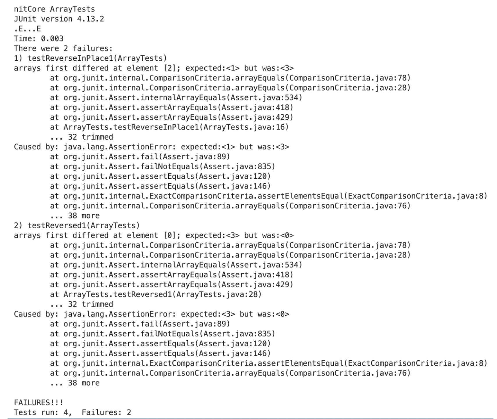

# Lab Report Week 3

In this lab report, I will go through what we've learned through week 2 and week 3.

## Part 1

Part 1 will include a web server called StringServer that keeps track of a single string being added to by incoming requests, which is showed below.


The following screenshots are my two trials of requests and output.


In my first trial of requests:

The "handleRequest" method is called with the argument "http://localhost:4000/add-message?s=Esther".
The "handleRequest" method checks if the path of the URI is */add-message*.
If it is */add-message*, it splits the query part of the URI (the part after the "?") by *=*.
If the first part of the split query is "s", it concatenates a new line (\n) and the second part of the split query to the "output" field of the class.
It returns the "output" field, which in this case is *null<String>\nCSE\nEsther\n*.

In my second trial of requests:

The "handleRequest" method is called with the argument "http://localhost:4000/add-message?s=apple".
The "handleRequest" method checks if the path of the URI is */add-message*.
If it is */add-message*, it splits the query part of the URI (the part after the "?") by *=*.
If the first part of the split query is "s", it concatenates a new line (\n) and the second part of the split query to the "output" field of the class.
It returns the "output" field, which in this case is *nullCSE\napple\n*.

The values of the relevant fields of the class change from this specific request by concatenating the value of the *s* parameter to the "output" field. In my first trial of requests, the "output" bcomes *null<String>\nCSE\nEsther\n* after 3 consecutive requests. In my second trial of output, the "output" becomes *nullCSE\napple\n* after 2 consecutive requests.

## Part 2

In part 2, I will go through the debugging process from lab 3. 

### Bug - Array ReverseInPlace Method

Below shows a failure-inducing input {1, 2, 3}. I expect the output to be a the reversed array which is {3, 2, 1} 

```
 @Test 
 public void testReverseInPlace1() {
    int[] input1 = {1, 2, 3};
    ArrayExamples.reverseInPlace(input1);
    assertArrayEquals(new int[]{3, 2, 1}, input1);
 }
```
But the actual output—the symptom—is below, that the element differs at index 2. The expected value is <1>, but it was actually <3>.



The bug in this code is that arr is continually updated, thus as you traverse the code, the array has already been modified when you arrive to the beginning of the array. 

But, for some input the failure is not induced like the one below.

```
  @Test 
  public void testReverseInPlace() {
    int[] input1 = { 3 };
    ArrayExamples.reverseInPlace(input1);
    assertArrayEquals(new int[]{ 3 }, input1);
  }

```

This is because the element only gets to be changed once.

Before finding the failure-inducing input, the code snippet is below. 

```
  // Changes the input array to be in reversed order
  static void reverseInPlace(int[] arr) {
    for(int i = 0; i < arr.length; i += 1) {
      arr[i] = arr[arr.length - i - 1];
    }
  }
```

After detecting the bug, the code is changed to below.

```
  // Changes the input array to be in reversed order
  static void reverseInPlace(int[] arr) {
    int[] currArr = new int[arr.length];
    for(int i = 0; i < arr.length; i += 1) {
      currArr[i] = arr[i];
    }
    for(int i = 0; i < arr.length; i += 1) {
      arr[i] = currArr[arr.length - i - 1];
    }
  } 
```

In this code snippet, the original array is first stored in a new *currArr* the same length as the input array, and then the input array is reversed according to the element from the opposite index in this *currArr*. This way, the original array won't be changed at the first few index.

## Part 3

I learned a lot during week 2 and 3, especially on how to handle different requests using url specific methods. I also learned how to use local github to commit code changes and push the new changes.  

